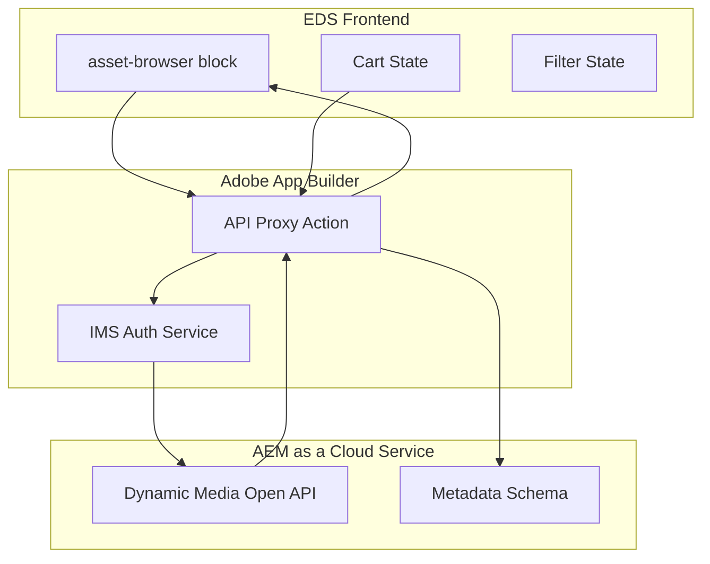

# Dynamic Media Asset Browser Block

## Architecture Overview




## Component Structure

### 1. EDS Block: `asset-browser`

- **Files to create:**
- [`blocks/asset-browser/asset-browser.js`](blocks/asset-browser/asset-browser.js) - Main block logic
- [`blocks/asset-browser/asset-browser.css`](blocks/asset-browser/asset-browser.css) - Styling
- [`blocks/asset-browser/_asset-browser.json`](blocks/asset-browser/_asset-browser.json) - Universal Editor model

### 2. App Builder Backend Proxy

- **Separate repository** - Adobe App Builder project with:
- `/actions/search` - Search assets with filters
- `/actions/metadata-schema` - Fetch filter options
- `/actions/download` - Generate secure download URLs for cart items
- IMS service-to-service authentication

## Block Features

### UI Components

| Component | Description ||-----------|-------------|| Category Pills | Top filter buttons (authored in UE) || Search Bar | Reuse existing search block pattern || View Toggle | Grid (4-col) / List view switcher || Asset Grid | Cards with thumbnail, metadata, actions || Filter Sidebar | Collapsible accordion filters || Cart Drawer | Slide-out cart with bulk download |

### Block Model (Universal Editor)

```json
{
  "apiEndpoint": "App Builder action URL",
  "repositoryId": "DM repository ID (delivery-pXXXX-eXXXX)",
  "defaultFilters": "Optional default filter state",
  "pageSize": "Number of assets per load (default 20)"
}
```


## API Integration

### Dynamic Media Open API Endpoints Used

Based on the [Adobe DM Open API documentation](https://developer.adobe.com/experience-cloud/experience-manager-apis/api/stable/assets/delivery/):

1. **Search Assets**: `GET /adobe/assets/search`

- Query parameters: `query`, `filter`, `limit`, `offset`
- Returns asset list with metadata

2. **Asset Metadata**: `GET /adobe/assets/{assetId}`

- Fetch detailed metadata for display

3. **Renditions**: `GET /adobe/assets/{assetId}/as/{format}`

- Thumbnail generation with width/height params

4. **Download**: Original asset delivery via signed URLs

## Implementation Todos

### Phase 1: Block Foundation

- Create block scaffolding with CSS grid layout
- Implement search bar component
- Build asset card component with placeholder data
- Add grid/list view toggle

### Phase 2: App Builder Proxy

- Set up App Builder project structure
- Implement IMS service-to-service authentication
- Create `/search` action with DM API integration
- Create `/metadata-schema` action for filter options

### Phase 3: Filter System

- Build collapsible filter sidebar
- Fetch filter options dynamically from metadata schema
- Implement filter state management
- Connect filters to search API

### Phase 4: Cart and Download

- Implement cart state (localStorage + UI)
- Build cart drawer component
- Create bulk download action in App Builder
- Generate signed download URLs

### Phase 5: Polish

- Add infinite scroll with intersection observer
- Loading states and skeletons
- Error handling and empty states
- Responsive design adjustments

## Key Files Modified