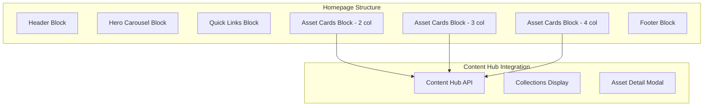

# Sage Digital Library - EDS Recreation Plan

## Design Analysis

The current site features:

- **Dark theme** (black background with Sage green `#00DC00` accents)
- **Custom typography** (bold headings, clean sans-serif body)
- **Card-based layouts** for asset categories with hover states
- **Multiple section types**: Hero carousel, quick links, feature cards, category grids

---

## Block Architecture



---

## Implementation Phases

### Phase 1: Foundation and Theming

Update global styles to implement Sage's dark theme and brand colors:

- Modify [`styles/styles.css`](styles/styles.css) with dark background, green accents
- Add Sage brand fonts (or use system fonts initially)
- Define CSS custom properties for consistent theming

### Phase 2: Header Block Enhancement

Modify [`blocks/header/header.js`](blocks/header/header.js) and [`blocks/header/header.css`](blocks/header/header.css):

- Dark navigation bar with Sage logo
- Navigation items: Home, Search, Brand Portal, Brand Assets, Training & FAQ
- User greeting placeholder (for future auth)

### Phase 3: New Blocks Creation

| Block | Purpose | File Location |

|-------|---------|---------------|

| **hero-carousel** | Rotating banner with CTA | `blocks/hero-carousel/` |

| **quick-links** | Horizontal pill buttons for popular items | `blocks/quick-links/` |

| **asset-cards** | Flexible grid of clickable asset category cards | `blocks/asset-cards/` |

### Phase 4: Asset Cards Block (Core Component)

This block powers "Featured Assets", "Featured Marketing", and "The Basics" sections:

- Supports 2, 3, or 4 column layouts via block variants
- Cards have: label badge, background image, rounded corners, green border on hover
- Click navigates to category page or Content Hub collection

### Phase 5: Content Hub API Integration

Create a utility module for Content Hub integration:

- `scripts/content-hub.js` - API client for fetching collections/assets
- Authentication handling for API calls
- Asset rendering utilities

### Phase 6: Footer Block

Update [`blocks/footer/footer.js`](blocks/footer/footer.js):

- Sage logo
- Copyright text
- Legal links (Privacy Policy, Terms, Technical Support)

---

## New Files to Create

```javascript
blocks/
├── hero-carousel/
│   ├── hero-carousel.js
│   ├── hero-carousel.css
│   └── _hero-carousel.json
├── quick-links/
│   ├── quick-links.js
│   ├── quick-links.css
│   └── _quick-links.json
├── asset-cards/
│   ├── asset-cards.js
│   ├── asset-cards.css
│   └── _asset-cards.json
scripts/
└── content-hub.js
```

---

## Component Models to Add

Update [`component-models.json`](component-models.json) and [`component-definition.json`](component-definition.json) for:

- Hero carousel slides (image, title, description, CTA)
- Quick link items (label, URL)
- Asset cards (label, image, link, optional Content Hub collection ID)

---

## Key Styling Specifications

| Element | Value |

|---------|-------|

| Background | `#000000` (pure black) |

| Primary accent | `#00DC00` (Sage green) |

| Card background | `#1a1a1a` or `#0d0d0d` |

| Card border (hover) | `1px solid #00DC00` |

| Border radius | `12px` (cards), `24px` (buttons) |

| Typography | Bold condensed headings, regular body |---

## Recommended Execution Order

1. Global theme/styles (foundation)
2. Header block (navigation)
3. Asset-cards block (most reused component)
4. Quick-links block
5. Hero-carousel block
6. Footer block
7. Content Hub integration